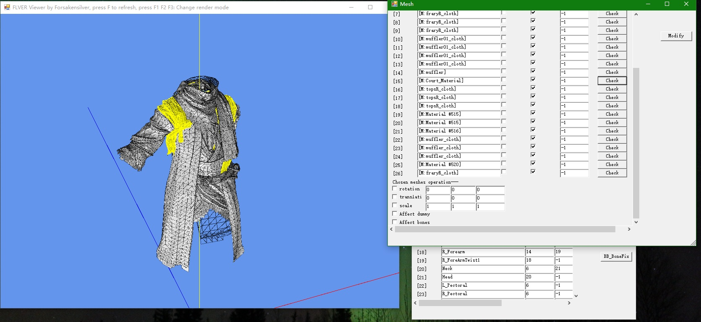

# FLVER_Editor

A probably multi-functional editor to edit Fromsoftware game's FLVER model file (Sekiro, Dark Souls, Bloodborne etc.)
Users can view and edit models, materials, dummy points inside the FLVER file and can also import external models into the FLVER file.

Special thanks to TKGP's souls format library and Zulie the witch, Katalash.

If you just want the .exe executable program, please download the release version at here: https://github.com/asasasasasbc/FLVER_Editor/releases

Author: Forsakensilver (遗忘的银灵)

Helpful/related programs:

UXM(Extract games' archive file):https://www.nexusmods.com/sekiro/mods/26

Yabber(Further unpack&repack files usch as partsbnd.dcx, .tpf texture file etc.): https://www.nexusmods.com/sekiro/mods/42

BB model extractor(Convert .flver model file to importable XPS file):https://forum.xentax.com/viewtopic.php?f=16&t=17332

## Update log

v1.9 Update

-Added texture loading functionality: the tpf file's name must be the same as flver file name.

-Added MySFormat.ini to help tweaking some special setting, such as loadTexture.

-Added more shading mode and F6: flat shading mode for better display.

1.87 Update

-In "Check vertex" window, added vertex mesh index info and vertex index info.

-Added : "delete vertex" and "delete vertex above/below" functionality

-Added: Silence vertex deletion functionality: ctrl + right click in 3d model viewing software to enter such mode, then press alt + right click to quick delete vertex.

v1.86 Update

-Added experimental "Export DAE" functionality

-More general bone display functionality

-Window maxmimum bug fixed

-Added LOD setting when import models

-Added Mesh->TBF ALL button

-Fixed minor LOD importing bug 

v1.82 Update

Added mesh->M. Reset functionality to help you port DS2 .flv file and make it compatible with new P[ARSN] material. 

Added Mesh->TBF, so that you can choose to render the back face or not.

Added back face rendering functionality

1.81 Update

-Added automatic material rename functionality.

-Added vertex right click edit functionality.

-Fixed auto set texture path bug.

1.8 Update

-Added skeleton display & toggle functionalty!

-Press B to toggle skeleton display and press M to toggle dummmy display!

1.73 Update

-Fixed xml auto edit bug and tangent flip bug. 

-Also revised Rev.Normal functionality. Now it also reverse the tangents.

-Also added bone shift functionality. When load "Bone.json" file, you can choose to shift bone weights indices according to their bone name.

1.71 Update

-Added "Material->Xml Edit" functionalty, so that editor can auto set texture description file depacked from .tpf file.

-Added "Import model->Auto set texture path" functionality, when importing fbx files, user can choose auto set texture path insead typing them manually. (Can auto read and set diffuse, specular and normal channels' first textures.)

1.68 Update

-Fixed Switch YZ axis functionality's UV coordinate problems when importing models.

1.67 Update

-Added "Mesh->N.Flip" button near the scale textfields. Scale the normals according to the values you typed in the scale textfields.

-Added Switch YZ axis functionality when you are importing fbx files into the scene. (Sometimes you still need to rotate 180 degrees in Y axis though.)

-Added "Mesh->Rotate in degrees" check box. By checking this you can rotate meshes in degrees instead of radiant.

-Added "Mesh->A" (select all or deselect all) buttons, so that you can select/deselect checkboxes quickly.

-Added Finding parent bone functionality. If a vertex is bind to a bone that does not exist in original flver file. It will try to find if its parent
bone is bind to a existing bone. If its parent or grandgrand...parent bone exists in flver scene, it will automatically bind to that bone instead of bind to the root bone.

-Support blender's "CATS" plugin's bone names.(https://github.com/michaeldegroot/cats-blender-plugin/releases) 
Once you click "Fix model" in that blender plugin, it will automatically rename every bones， and FLVER editor can automatically recongize these renamed bones' names and convert them to Sekiro/DS3 style bone names.

-Added a blue normal line to help you check the chosen vertex's normal.

1.65ex Update

-Fixed bone name convertion bug.

1.65 Update

-Added "Mesh->Delete faceset only" functionality. By checking this option, you can delete .hkx file related meshes without disable the .hkx file's cloth physics functionality.

-Added "Material->Export json" functionality. It can export formatted json text for you to edit.

-Added "Material->Edit" buttons, so that you can quickly edit the textures path and basic material information.

1.61 Update

-Added boneConvertion.ini file, this file can automaticly convert bone names from mixamo rig to sekiro/ds3 rig.

1.6 Update：

-Experimentally added importing complex model functionality (Mesh vertices count > 65535)

1.5 Update

-Changed Bones UI to display bones information efficiently and save CPU resources.

-Added Mesh->Rev.Mesh and Mesh->Rev.Normal functionalities to help you import models that have wrong normals or mirrored models.

-Added Material->M[ARSN] and Material->M[DUMMY] these two quite material changing methods. 

-Added helpful tips to all buttons when you hover your mouse on them.

-Disabled "Basic mode" becuase it is not necessary anymore.

-Added camera panning functionality by pressing mouse middle button.

1.42 Update:

-Fixed automatic back up bug.

-Added experimental bone weight importing functionality (import fbx bone)

-Added switch YZ axis functionality for convenience. (Because some format's imported model's YZ axis need to be switched to look correctly)

1.4 Update:

-Added import external 3d model file functionality

	Click [ImportModel] to import external 3d model file, such as fbx, dae, obj.
	
	Although Mesh, normal, tangents and UV coordinates can be preserved, you
	
	still need to manually change texture path at the Material window.
	
	(Special thanks to Katalash. His DSTOOLS code helped me develop this functionality. )

-Added automatic back up functionality.

	Save a .bak file in case something goes wrong.

-Mouse Right click: check the clicked vertex information.

-Added basic mode: 

	When there are too many bones, the editor may be slow, so I added this basic mode when handling models with a lot of bones.
	You can turn this mode on when editor is loading FLVER file that has a lot of bones

1.35 Update:

-Mesh->DS3 fix: Fix DS3 model not showing in Sekiro problem.

-Mesh->Attach: Attach another flver (I wish it is working ...)

-BufferLayout: Check but not edit the buffer layout.

## Basic tutorial

1.Double click the MySFformat to start the program, choose the flver file you want to edit.
(Alternate way: drag the flver to the .exe file to auotmatic open the file, or you can set the flver file open method to this .exe file.)

2.You will see two windows. One is FLVER viewer and another is FLVER Bones.

[FLVER viewer]

A window to help you check the model and see the changes you made.

Basic operation:

	-Mouse press and move: rotate your camera
	
	-Mouse scroll: move forward/backward
	
	-Numpad 2 and 8: Move up/down your camera
	
	-F1: Render mode: line
	
	-F2: Render mode: mesh
	
	-F3: Render mode: both
	
	-F: Refresh the scene
	
	-Mouse Right click: check the clicked vertex information.
	
[FLVER Bones]

This is your main working bench. In this window you can edit some basic bone and header information.

Components in the left pannel: 

	-A list of bones and their basic information.
	
		Allowing you to edit bone names and their parent/child bone information.
		Need to click the  "Modify" button in the right panel to save your change.
		
	-Bones Json text.
	
		Allowing you to directly editing all bones information in Json.
		Need to click the "ModifyJson" button in the right panel to save your Json change.
		
	-Header Json text.
	
		Allowing you to directly editing all header information in Json.
		Need to click the "ModifyJson" button in the right panel to save your Json change.
		
Components in the right panel:

	-Modify
		Save your change at the bone list part.
		
	-Material
		Open the [material] window.
		
	-Mesh
		Open the [mesh] window. So that you can transform meshes of the flver model.
		
	-Swap
		[Obsolete]Allowing you to swap mesh/material/bone information between two different flver file.
		It is used in some special or tricky cases and not very necessary. 
		But this is this program's first fuctionality, thus I kept it.
		
	-Dummy
		Open the [dummy] window. If you want to fix the sword trail and weapon art issue, click [dummy]->[SekiroFix]
		This program will automatically fix the issue.(You still need to manually change the dummy points position though.)
		
	-ModifyJson
		Save your change at the Json parts.
		
	-LoadJson
		Load an external bone Json file to change bone information.
		
	-BB_BoneFix
		Includes some special functionalities to help you fix some bone issues that occured in Sekiro when importing 
		Bloodborne flver files.
		
	-BufferLayout
		Check your current FLVER file's buffer layout information. It contains how will the program write things to the flver file.
		
	-Import Model
		Import external model files into the flver.
		After import, you need to click [Modify] to save your result.
		You may also need to rotate the mesh to fix the axis problem.
		
